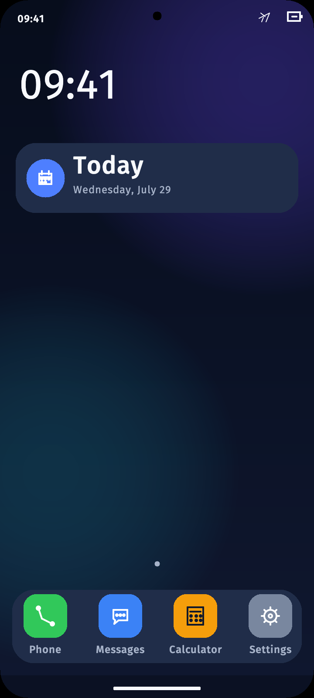

# Bndroid OS

Bndroid OS is an experimental Rust-first operating system project that explores Android-compatible application experiences on a non-Linux architecture.

The repository contains a custom AArch64 kernel, a supervised service model, storage and UI subsystems, and AndroidBox: a bounded compatibility layer for verifiable APK ingestion, resource parsing, DEX interpretation, Activity and UI projection, lifecycle supervision, and deterministic evidence tests.

Bndroid is research software. It is not an Android replacement, a general-purpose APK runtime, or production-ready software for physical devices.

## Demo



The image above is a 720x1600 mobile UI screenshot generated by `scripts/check-mobile-ui-runtime.sh` in local QEMU.

## Current scope

- A small Rust kernel targeting the QEMU `virt` AArch64 platform.
- Capability-oriented kernel objects, handles, VMOs, channels, events, and supervised processes.
- Storage, package, graphics, input, and application-data services with recovery tests.
- AndroidBox milestones covering layout and scene projection for controlled Android SDK, D8, and AAPT2 fixtures.
- Offline UI font data provided by Bndroid Sans Raster.

## Quick start

```sh
./scripts/build-kernel.sh
./scripts/check-qemu-boot.sh
```

See [TODO.md](TODO.md) for the focused roadmap and [PROJECT_MILESTONES.md](PROJECT_MILESTONES.md) for the historical milestone archive.

## Documentation

- [WHITEPAPER.md](WHITEPAPER.md): technical position, architecture, and research boundaries.
- [CONTRIBUTING.md](CONTRIBUTING.md): contribution workflow and project priorities.
- [CODE_OF_CONDUCT.md](CODE_OF_CONDUCT.md): community standards.
- [SECURITY.md](SECURITY.md): security issue reporting.
- [IMPLEMENTATION_STATUS.md](IMPLEMENTATION_STATUS.md): verified implementation status.
- [PROJECT_MILESTONES.md](PROJECT_MILESTONES.md): detailed AndroidBox and OS milestone evidence.

## Project boundaries and collaboration

Bndroid is a research project about Android-compatible experiences and Rust-first operating-system architecture. It is not intended to damage, bypass, attack, or abuse existing platforms, and the project does not accept code, documentation, or discussion intended for malicious use.

External contributions should be submitted through a fork and pull request. The `main` branch should remain protected: direct pushes, force-pushes, and branch deletion should be disabled, and changes should be reviewed before merging.

## License

Source code is licensed under the Apache License, Version 2.0. The Bndroid Sans Raster font asset is derived from OFL-licensed font software and remains available under the SIL Open Font License 1.1.

The repository-level license mapping is documented in [LICENSE](LICENSE), [NOTICE](NOTICE), and [.reuse/dep5](.reuse/dep5). The license texts in [LICENSE](LICENSE) and [LICENSES/](LICENSES/) are authoritative. Public-facing project introductions and documentation are maintained in English.
