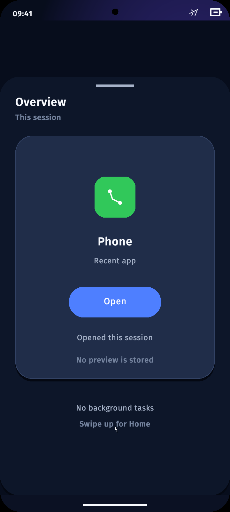

# Bndroid OS

Bndroid OS 是一个实验性的 Rust-first 操作系统项目，用来探索在非 Linux
发行版架构上实现 Android 应用兼容体验的可能性。

当前仓库包含自研 AArch64 内核、受监督的服务模型、存储与 UI 子系统，以及
AndroidBox：一个用于可验证 APK 摄取、资源解析、DEX 解释、Activity/UI 投影、
生命周期监督和确定性证据测试的兼容层。

这是研究软件。它还不是 Android 的直接替代品，不是通用 APK 运行时，也尚未
准备好用于生产设备。

## 项目展示



上图来自本仓库 `scripts/check-mobile-ui-runtime.sh` 在本地 QEMU 中生成的
720x1600 mobile UI 运行截图。

## 当前内容

- 面向 QEMU `virt` AArch64 平台的小型 Rust 内核。
- 基于能力边界的内核对象、句柄、VMO、通道、事件和受监督进程。
- 带恢复测试的存储、包管理、图形、输入和应用数据服务。
- AndroidBox 里程碑已覆盖受控 Android SDK/D8/AAPT2 fixture 的布局尺寸解析
  与 scene 投影。
- 离线 UI 字体数据 Bndroid Sans Raster。

## 快速开始

```sh
./scripts/build-kernel.sh
./scripts/check-qemu-boot.sh
```

项目的聚焦路线图见 [TODO.md](TODO.md)。原先首页上的详细历史里程碑已经保留在
[PROJECT_MILESTONES.md](PROJECT_MILESTONES.md)。

## 文档

- [WHITEPAPER.md](WHITEPAPER.md)：项目白皮书与技术定位。
- [CONTRIBUTING.md](CONTRIBUTING.md)：贡献流程、优先方向和不接受的内容。
- [CODE_OF_CONDUCT.md](CODE_OF_CONDUCT.md)：社区行为准则。
- [SECURITY.md](SECURITY.md)：安全问题报告流程。
- [IMPLEMENTATION_STATUS.md](IMPLEMENTATION_STATUS.md)：实现状态记录。
- [PROJECT_MILESTONES.md](PROJECT_MILESTONES.md)：AndroidBox 和 OS 的长篇里程碑归档。

## 项目边界与协作

Bndroid OS 是 Android 兼容体验和 Rust-first 操作系统架构的研究项目。项目不以
破坏、规避、攻击或滥用任何现有平台为目标，也不接受用于恶意用途的代码、文档或
讨论。

外部贡献默认通过 fork 和 Pull Request 进入。`main` 分支应保持受保护状态：禁止
直接 push、禁止 force push、禁止删除，并要求审核通过后合并。

## 许可证

源代码采用 Apache License, Version 2.0。名为 Bndroid Sans Raster 的字体资产
源自 OFL 授权字体软件，因此继续使用 SIL Open Font License 1.1。

仓库级许可证映射见 [LICENSE](LICENSE)、[NOTICE](NOTICE) 和
[.reuse/dep5](.reuse/dep5)。其中 `LICENSE` 与 `LICENSES/` 中的许可证文本为
权威法律文本；本文档中的中文说明仅用于阅读辅助。
