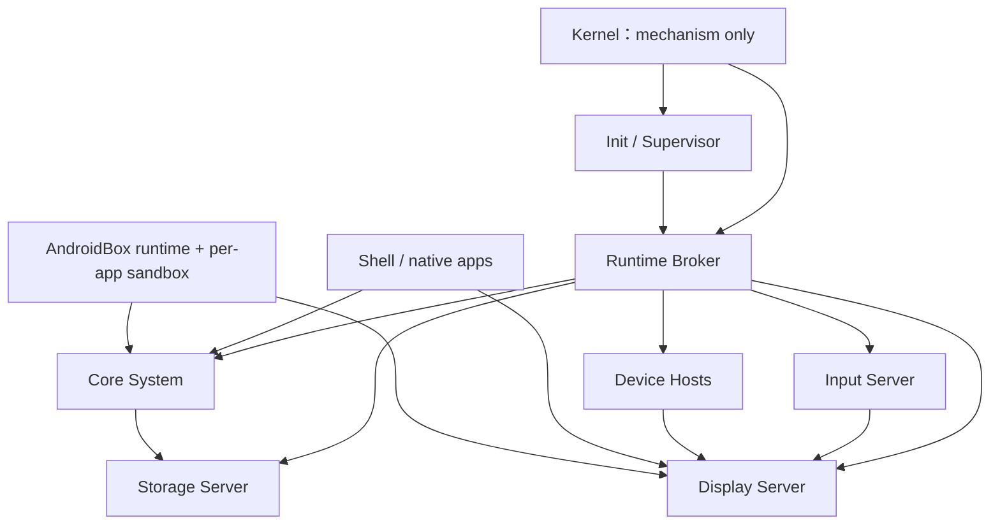

# Bndroid 精炼架构与产品待办

本文档是项目未来工作的唯一权威待办（single source of truth）。`README.md`
说明如何使用项目，`IMPLEMENTATION_STATUS.md` 只记录已经验证的事实，各
`ANDROIDBOX_*.md` 和 `Bndroid_OS_*.md` 保留里程碑证据与详细设计背景，不再分别
维护互相重复的未来任务。

## 1. 不变的产品目标

Bndroid 的目标仍然是成为安全、流畅、可维护的移动操作系统，并能运行 Android
应用。这里的“媲美 iOS 和 Android”必须由可测量结果证明，包括：

- 手机形态完整：锁屏、桌面、通知、控制中心、设置、多任务、输入法、无障碍。
- 交互流畅：稳定帧时间、低输入延迟、正确的窗口与生命周期、可恢复的系统服务。
- 产品能力完整：网络、音频、相机、传感器、电话、存储、权限、OTA 和备份恢复。
- 安全边界可靠：最小权限、应用隔离、签名安装、安全启动、密钥保护和可审计访问。
- Android 兼容可量化：真实 APK、ART、Bionic、Binder、JNI、Framework API 和
  兼容性测试逐级通过，而不是仅凭一个受限 fixture 宣称兼容。

当前项目仍是 QEMU 上的有界研究原型。现有 AndroidBox 严格 APK/DEX/资源/布局路径
是有价值的验证基础，但不等于通用 Android 运行时或真实手机。

## 2. 精炼原则

模块数量不是目标，清楚的所有权和故障边界才是目标。后续架构遵循以下规则：

1. 只有在权限、故障恢复、实时性或第三方 ABI 不同时才拆进程。
2. 只有在依赖方向、复用范围或独立测试确实不同时才拆 crate。
3. 同一事实只保留一个所有者；Android 接口通过 adapter 映射到原生服务，不复制
   第二套权限、包、窗口、网络或媒体数据库。
4. 内核只保留调度、内存、IPC、handle/capability、中断和最低限度硬件机制；产品
   策略放在用户态。
5. wire 类型集中在一个版本化 ABI 层；内部实现使用普通 Rust 类型，不为每个小
   里程碑复制一套协议结构。
6. 先保证语义等价和回归证据，再合并或删除。任何删除必须满足本文第 7 节的门槛。
7. 优先复用成熟上游实现。Android 兼容不再沿两条路线同时扩张，也不自行重写完整
   ART、Bionic 或 Android Framework。

## 3. 目标架构

### 3.1 保护域

下面是目标职责边界，不要求每个逻辑模块都成为独立仓库或 crate：

| 保护域 | 唯一职责 | 必须独立的原因 |
|---|---|---|
| Kernel | 内存、调度、IPC、handle/capability、中断、最小设备机制 | 最高权限，必须保持小且可审计 |
| Init / Supervisor | 启动、进程身份、依赖顺序、重启预算、降级与关机 | 必须能在其他服务失败后继续监督 |
| Runtime Broker | 服务发现、endpoint 发布、身份绑定和撤销 | 防止服务伪装并维持 capability 边界 |
| Core System | 包目录、权限策略、应用生命周期、账户/设置协调 | 高度共享同一产品状态，可作为一个服务内的模块 |
| Display Server | Surface、窗口树、合成、动画、VSync、截图和安全显示策略 | 同一帧事务必须由一个所有者提交 |
| Input Server | 设备事件规范化、焦点路由、手势、IME 接口 | 输入权限和故障域不同于显示 |
| Storage Server | block I/O、journal、应用数据、包 blob 和持久恢复 | 唯一持久化写权限，便于恢复与审计 |
| Device Hosts | 显示、触控、音频、相机、网络等驱动族 | 按权限和故障域分组，驱动崩溃不能拖垮内核 |
| Network / Media | 网络策略；音频、相机、codec 管线 | 解析不可信数据且有独立实时/权限要求 |
| AndroidBox | 每应用 Android 沙箱、运行时、Binder/Framework 适配 | 第三方 ABI 与攻击面不同，不能进入 Core System |
| Shell / Apps | Launcher、System UI、Settings 和普通应用 | 与系统服务分权，系统 UI 也不能获得隐式权限 |

早期 QEMU 产品可以把尚未接入硬件的 Network/Media 控制面暂时放入 Core System，
但接口和 capability 必须从第一天保持独立。接入真实网络、codec、相机或麦克风前，
必须迁出到独立保护域或受限 worker。

箭头表示受 capability 约束的依赖，不表示调用方获得被调用方的全部权限。

### 3.2 Rust crate 收敛

目标是把当前 10 个共享 crate 收敛为 7 个清楚的库；这是建议迁移，不是立即改名：

| 目标 crate | 吸收或复用 | 处理决定 |
|---|---|---|
| `bndr-abi` | 当前 `bndr-abi` | 保留；成为唯一公共 wire、错误码与版本入口 |
| `bndr-loader` | 当前 `bndr-elf` | 保留并改为通用 loader 命名；不与 Android parser 混合 |
| `bndr-runtime` | 当前 `bndr-sm` 和 supervisor/lifecycle 公共状态机 | 合并重复的注册、代际、重启预算状态机 |
| `bndr-graphics` | 当前 `bndr-ui` + `bndr-compositor` | 合并 scene/layout/raster/composition；UI policy 仍与应用代码分离 |
| `bndr-input` | 当前 `bndr-input` | 保留设备事件解析；删除自身重复的 scene/hit-test，复用 `bndr-graphics` |
| `bndr-persistence` | 当前 `bndr-storage` + `bndr-appdata` + `bndr-package-store` | 合并 block、journal、appdata、packages 子模块，共用事务与损坏恢复原语 |
| `bndr-androidbox` | 当前 `bndr-androidbox` | 保留为兼容层；依赖公共 ABI、loader、graphics 和 persistence 接口 |

crate 合并只减少代码组织和重复泛型，不改变进程权限。比如 AppData 和 PackageStore
可以共用持久事务库，但 Android 应用仍不能因此获得 StorageServer handle。

### 3.3 服务职责合并

以下概念不再规划为独立常驻服务：

- `WindowServer`、`Compositor`、`VSync`、动画、截图和安全显示合并为
  `DisplayServer` 内部模块，共用一次 frame transaction。
- `DriverManager` 的发现、启动和恢复并入 `Init/Supervisor`；具体驱动仍在
  `DeviceHost` 保护域。
- `PackageManager`、`PermissionManager`、`AppManager` 的控制面合并进
  `CoreSystem`，但各自保留强类型子模块、数据库 schema 和权限检查。
- `AudioServer`、`MediaServer`、`CameraServer` 共用 `Media` 控制面；不可信 codec
  和相机处理仍放入低权限 worker。
- 日志、trace 和 audit 共用一种事件传输与时间戳格式；审计数据仍有更严格的访问和
  保留策略。
- Launcher、System UI 和 Settings 共用一套 Shell UI 组件与 design tokens，但保持
  独立应用身份，避免一个 UI 漏洞获得全部系统权限。

以下边界不得为了“代码少”而合并：

- Kernel 与任何产品策略或 Android 运行时。
- Init/Supervisor 与可能处理不可信 APK、图片、网络包或媒体数据的进程。
- InputServer 与第三方应用。
- StorageServer 写权限与 PackageManager/Android 应用。
- DisplayServer 与应用渲染代码。
- 不同应用之间的地址空间、数据目录、权限和 Binder 身份。
- AndroidBox 与 CoreSystem 的权限数据库；AndroidBox 只能做映射，不能绕过它。

## 4. Android 应用兼容路线

### 4.1 唯一生产路线

生产路线采用“上游 Android 运行时组件 + Bndroid 适配层”，不把当前受限 DEX
解释器无限扩展成另一套 ART：

- 当前严格 APK/DEX/Resources 代码继续作为安装准入、格式验证、测试 oracle 和
  极小恢复界面使用。
- 选择一个冻结的 Android API/AOSP 基线后，复用上游 ART、Bionic、动态链接器、
  Binder 用户态、核心 Framework 与资源实现。
- `AndroidBox personality` 只实现 Bndroid 与这些组件之间必需的 syscall、内存、
  线程、信号、文件、时间和共享内存语义。
- `Android Service Bridge` 把 Android Package/Activity/Window/Input/Permission/
  Connectivity/Media API 映射到 Bndroid 的唯一原生服务，不复制产品状态。
- 每个 Android 应用使用独立 UID/进程/数据目录/capability 集；native `.so` 和 JNI
  与 managed code 处于同一应用沙箱。

在做出版本、许可证、磁盘、构建资源和维护成本决策前，不下载 AOSP，也不修改本机
Android SDK。任何下载或大规模第三方源码引入都需要用户明确授权。

### 4.2 分级验收

Android 兼容必须按以下等级逐级验收：

- [x] A0：仓库自有、严格受限 APK 的签名、安装、资源、DEX 子集和 QEMU UI 闭环。
- [ ] A1：ART 启动，真实 `ActivityThread` 运行一个仅 Java/Kotlin 的离线 APK。
- [ ] A2：Binder transaction/reply/death、ServiceManager 和最小 Framework 服务闭环。
- [ ] A3：Bionic、动态链接器、JNI 和至少一个自带 arm64 native `.so` 的 APK。
- [ ] A4：通用 Resources/View、生命周期、Intent、权限、scoped storage、网络和媒体。
- [ ] A5：建立目标 API 的兼容性测试矩阵，并通过一组非仓库定制的真实应用。
- [ ] A6：性能、功耗、后台限制、安全和升级兼容达到产品门槛。

未达到 A5 前，文档只能描述已经通过的子集，不能写“兼容 Android App”。Google
Play 服务或其他闭源组件不默认打包；其授权与分发必须单独解决。

### 4.3 Android 必要模块

以下组件功能不可删除，也不可互相冒充：

- ART/GC/JIT 或 AOT、DEX/OAT 与 `ActivityThread`。
- Bionic、动态链接器、线程/信号/TLS、JNI 和 native library 沙箱。
- Binder driver/personality、用户态 Binder、ServiceManager 与身份传播。
- Framework API、Resources、View/Compose 所需图形接口和 system services。
- Package、permission、intent、lifecycle、storage、network、media 的 bridge。
- API/ABI 版本数据库、兼容性测试、崩溃归因与应用级 kill switch。

## 5. 产品级待办

待办按依赖关系排序，不按乐观日历排序。每一阶段必须同时提供代码、自动化测试、
QEMU/真机证据、失败路径和边界说明。

### P0：封住当前基线

- [ ] 完成并记录 ABI 69 `androidbox-layout-mixed19` 的 host tests、父 profile 回归、
  QEMU 证据和截图；保持持续运行的 ABI 48 预览不受影响。
- [ ] 为现有 crate、binary、feature、wire 和持久 schema 生成依赖清单。
- [ ] 给所有运行时进程记录 owner、authority、输入、输出、重启策略和资源上限。
- [ ] 将本文件设为未来任务唯一入口，历史文档只追加已验证证据。

### P1：无行为变化的代码收敛

- [ ] 建立 `bndr-runtime` 公共 generation/registry/supervisor 状态机，迁移重复实现。
- [ ] 建立 `bndr-graphics`，让 layout、raster、hit-test 和 composition 共用同一 scene。
- [ ] 建立 `bndr-persistence` 的 journal/checksum/dual-slot/recovery 原语，再迁移
  appdata 与 package store；磁盘格式暂不改变。
- [ ] 把 echo provider/client 和 milestone-only binary 移到 test/fixture profile，
  不再进入产品镜像。
- [ ] 每次迁移保持旧 crate 的薄兼容 facade，完整门禁通过后才删除 facade。

### P2：协议与构建收敛

- [ ] 把连续的 `androidbox-*` 里程碑 feature 链收敛成
  `product-phone`、`android-compat`、`qemu-ci` 三类产品 profile。
- [ ] 旧 feature 暂作测试别名；所有父 ABI 和磁盘恢复门通过后才移除。
- [ ] ABI 采用“稳定 envelope + capability negotiation”，仅 wire 变化才升级版本。
- [ ] 自动生成协议编解码、长度断言和 compatibility matrix，删除手写重复常量。
- [ ] 将相同的 fixture build/QEMU 启动/截图/日志校验收敛为参数化 gate。

### P3：手机系统体验

- [ ] 建立统一 design tokens、字体、图标、间距、圆角、动态色和明暗主题。
- [ ] 完成锁屏、通知、控制中心、状态栏、手势导航、多任务和最近任务。
- [ ] 把 Settings 做成真实系统设置入口：显示、声音、网络、应用、权限、存储、
  隐私、安全、无障碍、系统更新。
- [ ] 完成 IME、Unicode shaping、locale、RTL、动态字体和无障碍语义树。
- [ ] 建立 60 Hz 基线和 120 Hz 路径；测量 P50/P95/P99 帧时间、输入到显示延迟、
  内存峰值和冷启动。
- [ ] UI 截图、像素 diff、语义、键盘/触控和旋转回归全部自动化。

### P4：AndroidBox A1—A4

- [ ] 写 ADR：选择 Android API/AOSP 基线、源码或预构建组件、许可证、更新策略和
  维护预算；获得明确授权后才获取外部组件。
- [ ] 启动 ART/Bionic 最小用户态，建立受限 Linux ABI/personality 测试。
- [ ] 实现 Binder 身份、transaction/reply/death 与 Bndroid capability 映射。
- [ ] 跑通 ActivityThread + Framework 的首个非定制 managed APK。
- [ ] 跑通 JNI/native `.so` APK，验证 W^X、RELRO、ASLR 和崩溃隔离。
- [ ] 依次桥接 package、permission、window/input、storage、network 和 media。
- [ ] 从真实应用行为生成 API 缺口数据库，禁止用 fixture 特判代替通用语义。

### P5：完整平台能力

- [ ] 网络：IPv4/IPv6、DNS、TLS、Wi-Fi、VPN、热点、防火墙和每应用计量。
- [ ] 媒体：音频焦点、录放音、codec、相机、蓝牙音频和权限指示器。
- [ ] 电话：SIM/eSIM、基带接口、通话、短信、紧急呼叫和监管要求。
- [ ] 电源：suspend/resume、DVFS、thermal、后台冻结、alarm 和电池统计。
- [ ] 安全：verified boot、file-based encryption、Keystore、硬件密钥、SELinux
  等价策略、漏洞响应和安全 OTA。
- [ ] 数据：多用户、备份恢复、配额、媒体库、卸载擦除和隐私导出。

### P6：真机与发布

- [ ] 由用户明确指定首个开发设备后，再制定 BSP、bootloader、device tree、HAL、
  GPU/display、触控、存储、Wi-Fi、音频、相机、传感器和 modem 清单。
- [ ] 未获授权前不连接、解锁、刷写或修改任何实体设备。
- [ ] 建立 recovery、A/B OTA、rollback protection、factory reset 和救砖流程。
- [ ] 在实体设备验证功耗、温度、待机、通话、相机、网络切换和真实断电恢复。
- [ ] 通过安全审计、长时间 soak、兼容性、性能与升级矩阵后才定义日用版本。

## 6. 可复用而不重复实现的接口

| 产品事实 | 唯一所有者 | Android/原生调用方式 |
|---|---|---|
| 应用身份与包版本 | Core System package catalog | 原生 API + Android Package bridge |
| 权限决定 | Core System permission policy | capability + Android permission bridge |
| 窗口与 Surface | Display Server | 原生 Surface API + Android Surface bridge |
| 输入焦点 | Input Server | 原生 events + Android Input bridge |
| 应用数据 | Storage Server | 原生 storage API + scoped-storage bridge |
| 网络策略 | Network service | 原生 socket policy + Connectivity bridge |
| 音频/相机状态 | Media service | 原生 media API + Android media bridge |
| 日志与审计时间线 | Runtime observability substrate | 不同访问策略下复用同一事件格式 |

任何新模块若要保存这些事实的第二份可写副本，必须先写 ADR 解释一致性、恢复和权限
模型；默认方案是引用或查询唯一所有者。

## 7. 合并与删除门槛

只有同时满足以下条件，才允许删除旧模块、旧 feature、旧协议或旧实现：

1. 新实现覆盖旧实现的全部成功和失败语义。
2. capability、进程身份、资源上限和持久恢复没有变弱。
3. 旧 profile、父 ABI、磁盘恢复和至少一个负向安全门全部通过。
4. 迁移前后可观测输出有明确映射，故障仍可定位。
5. 没有仍在引用旧接口的产品 binary、fixture 或文档。
6. 删除内容属于重复实现、兼容 facade 或测试样板，不是必要产品能力。

允许优先删除的对象：

- 已被参数化 gate 覆盖的重复 shell/Python 检查逻辑。
- 只用于历史演示且不进入产品依赖图的 echo/demo binary。
- 已迁移到公共状态机后的重复 generation、retry、checksum 和 dual-slot 实现。
- 已由产品 profile 覆盖的 milestone feature 别名。
- 蓝图中的通用占位 TODO 和重复模板文字。

禁止删除的对象：

- 安全负向测试、崩溃/断电恢复测试和兼容性回归证据。
- ABI/schema 迁移所需 decoder，除非支持窗口已明确结束。
- 应用、输入、显示、存储、驱动和 Android runtime 的隔离边界。
- Android 运行所需的 ART、Bionic、Binder、Framework、JNI 和系统服务语义。
- 真机所需的 BSP/HAL/启动链；它们可以延后，但不能被文档假设替代。

## 8. 完成定义

一个任务只有同时满足以下条件才可勾选：

- 代码和文档使用同一接口名称、ABI 版本和能力边界。
- host 单测、静态检查以及对应 QEMU/真机门通过。
- 至少验证一个失败路径；安全敏感任务还需要权限拒绝和身份伪造负例。
- 持久任务覆盖重启、撕裂写入或断电模型；UI 任务覆盖截图、语义和输入命中。
- 证据目录、命令、摘要和限制被记录，且没有把子集描述成通用兼容。
- 新增外部依赖、网络、AOSP、SDK 修改或真机操作均有用户明确授权。

